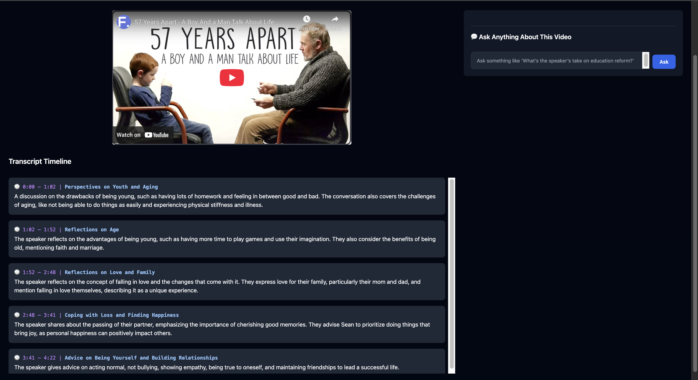
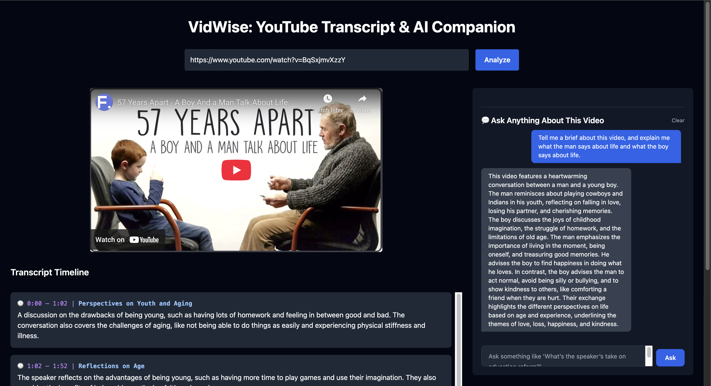

# 🎥 VidWise: AI-Powered YouTube Companion

VidWise is a full-stack web app that enhances YouTube video understanding using **AI-powered summarization** and **natural language Q&A**.

<p align="center">
  
</p>

---

## 🔍 Features

- 🎞️ **Auto Transcript Summarization**: Breaks video into digestible 5–10s segments
- 🧠 **AI Chatbot**: Ask anything about the video – with contextual understanding
- ⏱️ **Clickable Timestamps**: Jump directly to relevant moments
- 🧵 **Persistent Chat History**: Scrollable, real-time conversation
- 🎨 **Clean, Responsive UI**: Optimized for web & mobile

---

## 🛠️ Tech Stack

| Frontend         | Backend              | AI/NLP          | Others                  |
|------------------|----------------------|------------------|--------------------------|
| React.js, TailwindCSS | FastAPI (Python) | OpenAI GPT-3.5 Turbo | ffmpeg, yt-dlp          |
| React YouTube     | Redis (optionally)  | HuggingFace Transformers | SentenceTransformers   |

---

## 🚀 How It Works

1. **Paste YouTube URL**  
2. Backend:
   - Downloads audio (`yt-dlp`)
   - Transcribes with OpenAI Whisper (or Whisper API)
   - Summarizes timeline chunks (via `gpt-3.5-turbo`)
   - Embeds & indexes chunks for vector search
3. Ask questions → AI replies with linked timestamps

---

## 🖥️ Demo Screenshots

| Transcript Timeline | AI Chat Companion |
|---------------------|-------------------|
|  |  |

---

## 🧩 Project Structure

```bash
vidwise-ai/
├── backend/
│   ├── app/
│   │   ├── api/           # FastAPI routes
│   │   ├── core/          # whisper, embedder, summarizer, chatbot
│   │   └── main.py        # Entry point
│   ├── requirements.txt
│   └── .env
├── frontend/
│   ├── src/components/AskAI.jsx
│   ├── App.jsx
│   └── index.html
```

---

## 💡 Notable Implementation Highlights

- 🧠 **LLM-Powered Summarization**  
  - Dynamically chunks transcript and asks GPT for bullet-style summaries.

- 🔎 **RAG Q&A Pipeline**  
  - Uses SentenceTransformer + FAISS vector search to build a real-time Q&A system.

- 🧼 **Storage Optimized**  
  - Auto-deletes downloaded MP3 files post-processing to prevent disk overload on deployment.

- ⚡ **Responsive UI**  
  - Built with TailwindCSS + YouTube iframe API for timestamp-seeking.

---

## 📌 Local Setup

### 1. Backend (FastAPI)

```bash
cd backend
python3 -m venv venv
source venv/bin/activate
pip install -r requirements.txt
uvicorn app.main:app --reload
```

> ⚠️ Add `.env` file with your OpenAI API key:
```
OPENAI_API_KEY=sk-...
```

### 2. Frontend (React)

```bash
cd frontend
npm install
npm run dev
```

Frontend runs at `localhost:5173`, Backend at `localhost:8000`

---

## 📁 Sample Prompt (Chat):

```
What is the speaker's take on education reform? Provide timestamps to support.
```

💬 Returns a well-structured answer + jumpable timestamp links like:
```
"At 5:34, the speaker critiques the outdated structure... By 11:42, they propose a shift to..."
```

---

## 🧠 Author

**Aashray Chapagai** – CS @ Sewanee  
👨‍💻 Passionate about full-stack dev, AI, and impactful software

📬 [Connect on LinkedIn](https://linkedin.com/in/chapagaiaashray)  


---

## ⭐️ Star the Project if You Found it Useful!
